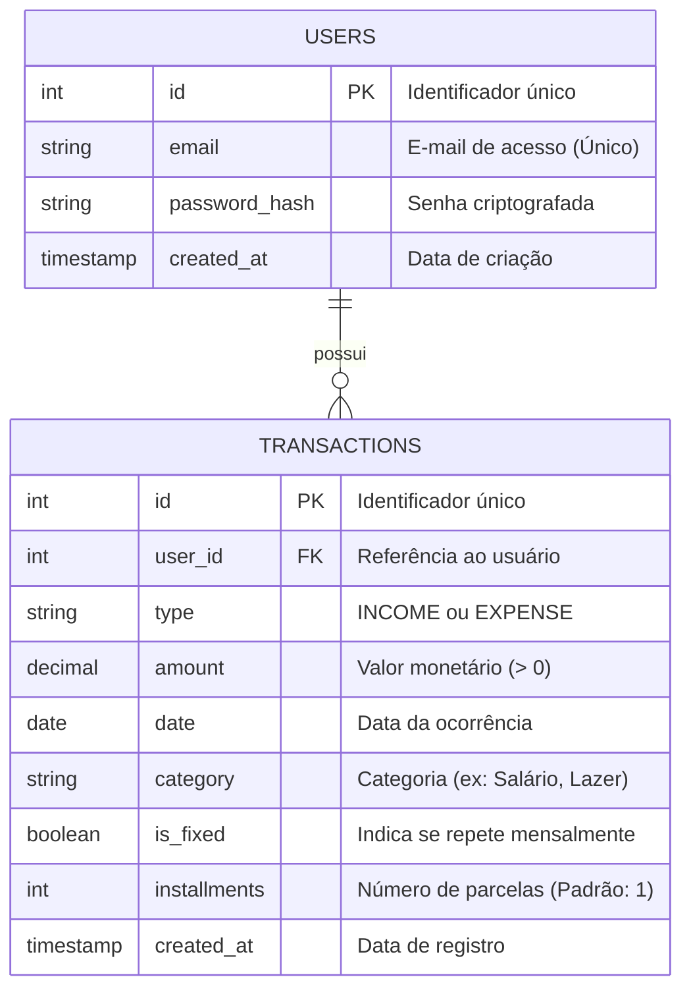

# Diagrama de Classes e Entidades (MER)

Este documento mapeia as entidades principais do sistema Meu Orçamento, refletindo a estrutura do banco de dados e as classes do domínio.

## Relacionamentos
* Um **Usuário** pode registrar múltiplas **Transações** (1 para N).
* A exclusão de um Usuário resulta na exclusão em cascata (Cascade) de todas as suas Transações.

## Diagrama (Mermaid)



## Diagrama de Classes (Arquitetura do Backend)

Este diagrama detalha a estrutura Orientada a Objetos do sistema, demonstrando a aplicação de princípios SOLID (como Inversão de Dependência) e o uso do padrão de projeto Strategy para regras financeiras.

```mermaid
classDiagram
    %% Camada de Controladores (Entrada)
    class AuthController {
        +login(req, res)
        +register(req, res)
    }
    class TransactionController {
        +create(req, res)
        +listByUser(req, res)
    }

    %% Camada de Serviços (Regras de Negócio)
    class UserService {
        +registerUser(data) User
        +authenticate(email, password) String
    }
    class TransactionService {
        +addTransaction(data) Transaction
        +getSummary(userId) Object
    }

    %% Padrão Strategy (Regras de Entrada/Saída)
    class ITransactionStrategy {
        <<interface>>
        +process(transactionData) void
    }
    class IncomeStrategy {
        +process(transactionData) void
    }
    class ExpenseStrategy {
        +process(transactionData) void
    }

    %% Camada de Repositórios (Banco de Dados)
    class IUserRepository {
        <<interface>>
        +findByEmail(email) User
        +save(user) User
    }
    class ITransactionRepository {
        <<interface>>
        +findByUserId(userId) List
        +save(transaction) Transaction
    }
    class UserRepository {
        +findByEmail(email) User
        +save(user) User
    }
    class TransactionRepository {
        +findByUserId(userId) List
        +save(transaction) Transaction
    }

    %% Relacionamentos e Fluxos
    AuthController --> UserService : chama
    TransactionController --> TransactionService : chama
    
    UserService --> IUserRepository : depende de
    TransactionService --> ITransactionRepository : depende de
    TransactionService --> ITransactionStrategy : utiliza
    
    ITransactionStrategy <|.. IncomeStrategy : implementa
    ITransactionStrategy <|.. ExpenseStrategy : implementa
    
    IUserRepository <|.. UserRepository : implementa
    ITransactionRepository <|.. TransactionRepository : implementa