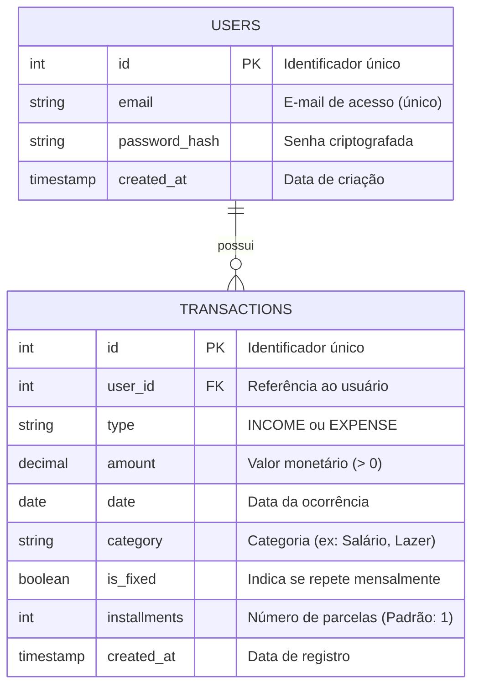
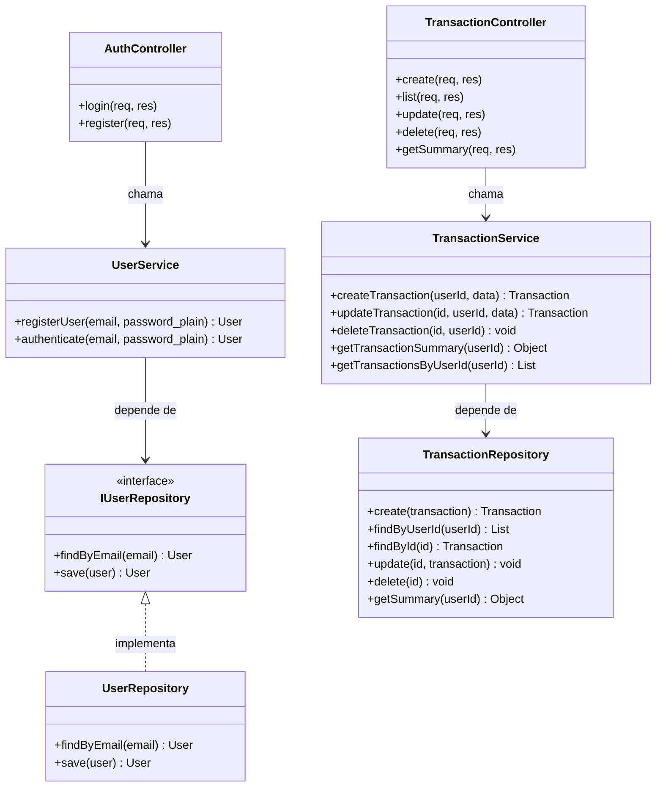

# Diagrama de Classes e Entidades (MER)

Este documento mapeia as entidades principais do sistema Meu Orçamento, refletindo a estrutura do banco de dados e as classes do domínio.

## Relacionamentos
* Um **Usuário** pode registrar múltiplas **Transações** (1 para N).
* A exclusão de um Usuário resulta na exclusão em cascata (Cascade) de todas as suas Transações.

## Diagrama de Entidade-Relacionamento (ER)

```mermaid
erDiagram
    USERS ||--o{ TRANSACTIONS : "possui"
    
    USERS {
        int id PK "Identificador único"
        string email "E-mail de acesso (único)"
        string password_hash "Senha criptografada"
        timestamp created_at "Data de criação"
    }
    
    TRANSACTIONS {
        int id PK "Identificador único"
        int user_id FK "Referência ao usuário"
        string type "INCOME ou EXPENSE"
        decimal amount "Valor monetário (> 0)"
        date date "Data da ocorrência"
        string category "Categoria (ex: Salário, Lazer)"
        boolean is_fixed "Indica se repete mensalmente"
        int installments "Número de parcelas (Padrão: 1)"
        timestamp created_at "Data de registro"
    }
```

## Diagrama de Classes (Arquitetura do Backend)

Este diagrama detalha a estrutura Orientada a Objetos do sistema, refletindo a injeção de dependências via repositórios e serviços.

```mermaid
classDiagram
    %% Camada de Controladores (Entrada)
    class AuthController {
        +login(req, res)
        +register(req, res)
    }
    class TransactionController {
        +create(req, res)
        +list(req, res)
        +update(req, res)
        +delete(req, res)
        +getSummary(req, res)
    }

    %% Camada de Serviços (Regras de Negócio)
    class UserService {
        +registerUser(email, password_plain) User
        +authenticate(email, password_plain) User
    }
    class TransactionService {
        +createTransaction(userId, data) Transaction
        +updateTransaction(id, userId, data) Transaction
        +deleteTransaction(id, userId) void
        +getTransactionSummary(userId) Object
        +getTransactionsByUserId(userId) List
    }

    %% Camada de Repositórios (Banco de Dados)
    class IUserRepository {
        <<interface>>
        +findByEmail(email) User
        +save(user) User
    }
    class UserRepository {
        +findByEmail(email) User
        +save(user) User
    }
    class TransactionRepository {
        +create(transaction) Transaction
        +findByUserId(userId) List
        +findById(id) Transaction
        +update(id, transaction) void
        +delete(id) void
        +getSummary(userId) Object
    }

    %% Relacionamentos e Fluxos
    AuthController --> UserService : chama
    TransactionController --> TransactionService : chama
    
    UserService --> IUserRepository : depende de
    TransactionService --> TransactionRepository : depende de
    
    IUserRepository <|.. UserRepository : implementa
```